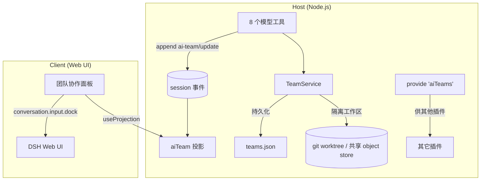

# dsh-ai-team

> DeepSeek Harness 插件：让 AI Agent 模拟一支拥有**独立工作空间、共享代码仓库、分支协作、任务分配与代码审查**的软件开发团队。

[](https://nodejs.org)
[](./LICENSE)
[](https://github.com/yunqiangwu/dsh-ai-team/actions/workflows/ci.yml)
[](https://pnpm.io)

English abstract — `dsh-ai-team` is a dual-sided (Host + Client) plugin for
[DeepSeek Harness](https://github.com/deepseek-ai/deepseek-harness). It gives
AI agents a Cordis-plugin that simulates a software team: each member (leader /
developer / reviewer) gets an **isolated workspace** (a git worktree of a shared
repository), tasks flow through a kanban board, and code review verdicts gate
merges into the base branch. A Web UI panel shows the team live.

---

## 目录

- [特性](#特性)
- [架构](#架构)
- [快速开始](#快速开始)
- [配置](#配置)
- [工具参考](#工具参考)
- [协作流程](#协作流程)
- [目录结构](#目录结构)
- [开发](#开发)
- [与其他插件协作](#与其他插件协作)
- [设计决策](#设计决策)
- [路线图](#路线图)
- [许可证与贡献](#许可证与贡献)

## 特性

- **团队管理**：`team_create` 一键建团（必须含 1 名 leader），`team_add_member` 按需扩充 developer / reviewer。
- **隔离工作空间**：每位成员拥有独立 git worktree，共享同一 object store——既隔离又天然支持分支协作。
- **分支协作**：在共享仓库中创建 / 切换 / 合并分支（`team_branch`）。
- **任务分配**：leader 用 `task_assign` 把任务拆到看板上，自动从 base 拉出 `task/<id>` 分支并检出到成员工作区。
- **代码审查**：`code_review` 是合并的唯一闸门——`approve` 以 `--no-ff` 合入 base，`request_changes` 打回计轮次；合并冲突则拒绝并保持 `in_review`。
- **Web 协作面板**：DSH Web UI 的 `conversation.input.dock` 插槽内实时展示成员 / 工作空间状态 / 活跃分支 / 五列任务看板（zh / en 双语）。
- **自动清理**：`ctx.provide('aiTeams')` 暴露服务；`ctx.effect()` 保证插件卸载时落盘并释放监听。

## 架构



Host 端与 Web 端通过 **session 事件 + 投影** 通信，无需自行实现 RPC。

## 快速开始

### 1. 作为依赖安装（已发布到 npm 时）

```bash
pnpm add dsh-ai-team
```

然后在 profile 的 `cordis.patch.yml` 中引用：

```yaml
- insert:
    - id: ai-team
      name: dsh-ai-team
      config:
        rootDir: .dsh-ai-team
        baseBranch: main
```

### 2. 本地开发调试

```bash
pnpm install
pnpm build
pnpm dsh web --patch ./cordis.patch.yml
```

开发期也可把 `cordis.patch.yml` 中 `name` 指向源码：`./src/index.ts`（需要 host 端 TS 直跑支持）。

### 3. 分发 / 装入 profile

```bash
dsh plugin --profile web add ./dsh-ai-team
```

## 配置

插件通过 `inject: ['tools']`（及可选的 `sessionProjections` / `sessions`、`slots`、`locale` 客户端服务）声明依赖，
配置结构使用 `@deepseek-ai/schemastery` 在加载时即被校验：

| 字段 | 类型 | 默认值 | 说明 |
|---|---|---|---|
| `rootDir` | string | `.dsh-ai-team` | 团队共享仓库与成员工作区的根目录（相对路径相对于 DSH host 的 CWD） |
| `stateDir` | string | `''`（同 `rootDir`） | `teams.json` 持久化目录；留空则使用 `rootDir` |
| `baseBranch` | string | `main` | 所有 task 分支的起点，已批准审查合入的目标分支 |
| `maxMembers` | number | `8` | 单团队最大成员数（含 leader） |
| `maxTasks` | number | `256` | 单团队最大任务数 |

## 工具参考

Host 端在 `ctx.tools` 上注册 8 个供模型调用的工具（每次变更都会 append `ai-team/update` 事件驱动面板刷新）：

| 工具 | 作用 |
|---|---|
| `team_create` | 创建团队与共享仓库、初始名册（必须含 1 名 leader）；返回团队 |
| `team_add_member` | 按角色（`leader`/`developer`/`reviewer`）添加成员，派生隔离工作区并返回其 `systemPrompt` |
| `team_list` | 列出所有团队（成员 / 工作区 / 分支 / 任务看板） |
| `team_status` | 查看单团队详情（成员、工作区状态、活跃分支、任务看板、审查） |
| `task_assign` | leader 派单：从 base 拉 `task/<id>` 分支并检出到成员工作区，任务置 `pending` |
| `task_update` | 任务沿看板推进：`pending → in_progress → in_review`（终态由审查流控制） |
| `team_branch` | 共享仓库分支协作：`list` / `create` / `switch` / `merge` |
| `code_review` | reviewer 对 `in_review` 任务下结论：`approve` 合入 base；`request_changes` 打回 |

完整参数与返回值见 [`src/tools.ts`](./src/tools.ts)。

## 协作流程

1. **建团**：`team_create` 创建共享仓库与 leader。
2. **扩员**：`team_add_member` 增加 developer / reviewer，各自拿到独立 worktree 与角色系统指令。
3. **派单**：leader 用 `task_assign` 把任务落到看板——插件自动建 `task/<id>` 分支并切到该成员工作区。
4. **开发**：developer 在隔离工作区写代码，`task_update` 推进到 `in_review`。
5. **审查**：reviewer 用 `code_review` 评审；`approve` 自动 `--no-ff` 合入 base 并关闭任务，`request_changes` 打回（计入返工轮次）。
6. **观察**：Web 协作面板实时反映成员状态、分支与看板。

## 目录结构

```
dsh-ai-team/
├── cordis.patch.yml        # 开发期挂载插件到组合树
├── src/
│   ├── index.ts            # Host 入口：name / inject / Config / apply / provide
│   ├── service.ts          # TeamService（与 cordis 解耦，可独立测试）
│   ├── git.ts              # 每成员一个 git worktree（共享 object store）
│   ├── roles.ts            # leader / developer / reviewer 系统指令
│   ├── tools.ts            # 8 个模型工具
│   ├── events.ts           # 自定义 session 事件声明
│   ├── projection.ts       # aiTeam 投影（last-write-wins）
│   ├── view.ts             # 视图类型
│   └── client/             # Web 协作面板（React）
│       ├── index.tsx       # Client 入口：注入插槽 / 双语字典
│       ├── TeamPanel.tsx   # 面板组件
│       ├── contract.ts     # 客户端类型契约
│       └── styles.ts       # 面板样式
├── tests/
│   ├── test-integration.ts # 多 Agent 协作全流程（16 断言）
│   └── smoke-cordis.ts     # 真实 cordis Context 加载构建产物（4 断言）
└── lib/                    # 构建产物（git 忽略）
```

## 开发

要求：Node.js ≥ 22.19，pnpm。

```bash
pnpm install        # 安装依赖（含 esbuild 构建脚本许可已写入 pnpm-workspace.yaml）
pnpm build          # tsc(host) + tsc(client) + tsdown → lib/index.js + lib/client.js
pnpm typecheck      # 两端类型检查（不产出）
pnpm test           # 运行集成测试
pnpm exec tsx tests/smoke-cordis.ts   # 运行 cordis 冒烟测试
```

### 代码约定

- TypeScript ESM（`"module": "NodeNext"`），相对导入**必须带 `.js` 后缀**。
- Host 端逻辑与 Cordis 解耦（`TeamService` 不依赖 `ctx`，便于测试）。
- 通过 `ctx` 注册的一切资源随插件生命周期自动清理；外部资源用 `ctx.effect()` 手动清理。
- 所有扩展都通过新插件实现，不修改 DSH 核心文件。

## 与其他插件协作

本插件通过 `ctx.provide('aiTeams', service)` 暴露 `TeamService`，其它插件可：

```ts
import { inject } from 'cordis'

export const inject = ['aiTeams']
export function apply(ctx: Context) {
  const team = ctx.aiTeams.getTeam('team-id')
  // ...
}
```

## 设计决策

- **工作空间隔离 = git worktree**：比复制目录轻量，且分支协作零成本；合并统一在常驻 base 分支的集成检出执行。
- **数据流免 Typert**：状态快照走 session 事件 + 投影，客户端 `useProjection('aiTeam')` 响应式渲染，无需 RPC 代码生成。
- **审查即门控**：`done` / `changes_requested` 只能经 `code_review` 到达；合并冲突会拒绝 `approve` 并保持 `in_review`。

## 路线图

- [ ] 多团队并发与资源配额
- [ ] reviewer 自动基于 diff 生成审查意见
- [ ] 与 DSH `subagent` / `todo` 服务的原生互操作
- [ ] 分支冲突的可视化解决入口

## 许可证与贡献

- 许可证：[MIT](./LICENSE)
- 贡献指南：见 [CONTRIBUTING.md](./CONTRIBUTING.md)
- 行为准则：见 [CODE_OF_CONDUCT.md](./CODE_OF_CONDUCT.md)
- 安全披露：见 [SECURITY.md](./SECURITY.md)

欢迎 Issue 与 PR。
